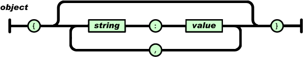

> ## Learning Objectives {.objectives}
>
> * Introduce the JSON format
> * Review Python data types and relate to the JSON format
> * Insert a document, understand the purpose of it's `_id`
> * Introduce MongoDB's "Binary JSON" (BSON) format

[JSON](reference.html#json), i.e. JavaScript Object Notation, is a lightweight
data-interchange format built on two universal data structures [^1]:

[^1]: The intro to JSON here, including the railroad diagrams, were taken from [json.org](http://json.org).

* a mapping of names to values. In various languages, this is realized as an object, record, struct, dictionary, hash table, keyed list, or associative array.
* an ordered list of values. In most languages, this is realized as an array, vector, list, or sequence.

In JSON, they take on these forms:

* An *object* is an unordered set of name/value pairs.

    ~~~ {.python}
    {'material_id': 'mp-568345', 'nelements': 1, 'pretty_formula': 'Fe'}
    ~~~
    

* An *array* is an ordered collection of values.

    ~~~ {.python}
    [{'material_id': 'mp-568345', 'nelements': 1, 'pretty_formula': 'Fe'},
     {'material_id': 'mp-12671', 'nelements': 3, 'pretty_formula': 'Er2SO2'},
     {'material_id': 'mp-1703', 'nelements': 2, 'pretty_formula': 'YbZn'}]
    ~~~
    

* A *value* can be a *string* in quotes, or a *number*, or **true** or **false** or **null**, or an *object* or an *array*. These structures can be nested.

    ~~~ {.python}
    {'material_id': 'mp-2340',
     'chemsys': 'Na-O',
     'has_bandstructure': True,
     'elasticity': None,
     'elements': ['Na', 'O'],
     'nelements': 2,
     'pretty_formula': 'Na2O2',
     'spacegroup': {
       'crystal_system': 'hexagonal',
       'hall': 'P -6 -2',
       'number': 189,
       'point_group': '-6m2',
       'source': 'spglib',
       'symbol': 'P-62m'}}
    ~~~
    

* A *string* is a sequence of zero or more Unicode characters, wrapped in double quotes, using backslash escapes. A character is represented as a single character string. A string is very much like a C or Java string.

    ~~~ {.python}
    {'material_id': 'mp-2340',
     'cif': "#\\#CIF1.1\n##########################################################################\n#               Crystallographic Information Format file \n#               Produced by PyCifRW module\n# \n#  This is a CIF file.  CIF has been adopted by the International\n#  Union of Crystallography as the standard for data archiving and \n#  transmission.\n#\n#  For information on this file format, follow the CIF links at\n#  http://www.iucr.org\n##########################################################################\n\ndata_Na2O2\n_symmetry_space_group_name_H-M          'P 1'\n_cell_length_a                          6.27944383\n_cell_length_b                          6.27944383387\n_cell_length_c                          4.50693686\n_cell_angle_alpha                       90.0\n_cell_angle_beta                        90.0\n_cell_angle_gamma                       120.000000032\n_chemical_name_systematic               'Generated by pymatgen'\n_symmetry_Int_Tables_number             1\n_chemical_formula_structural            Na2O2\n_chemical_formula_sum                   'Na6 O6'\n_cell_volume                            153.905615363\n_cell_formula_units_Z                   3\nloop_\n  _symmetry_equiv_pos_site_id\n  _symmetry_equiv_pos_as_xyz\n   1  'x, y, z'\n \nloop_\n  _atom_site_type_symbol\n  _atom_site_label\n  _atom_site_symmetry_multiplicity\n  _atom_site_fract_x\n  _atom_site_fract_y\n  _atom_site_fract_z\n  _atom_site_attached_hydrogens\n  _atom_site_B_iso_or_equiv\n  _atom_site_occupancy\n   O  O1  1  0.666667  0.333333  0.327586  0  .  1\n   O  O2  1  0.666667  0.333333  0.672414  0  .  1\n   O  O3  1  0.333333  0.666667  0.672414  0  .  1\n   O  O4  1  0.333333  0.666667  0.327586  0  .  1\n   O  O5  1  0.000000  0.000000  0.829456  0  .  1\n   O  O6  1  0.000000  0.000000  0.170544  0  .  1\n   Na  Na7  1  0.000000  0.699801  0.500000  0  .  1\n   Na  Na8  1  0.300199  0.300199  0.500000  0  .  1\n   Na  Na9  1  0.699801  0.000000  0.500000  0  .  1\n   Na  Na10  1  0.000000  0.365556  0.000000  0  .  1\n   Na  Na11  1  0.634444  0.634444  0.000000  0  .  1\n   Na  Na12  1  0.365556  0.000000  0.000000  0  .  1\n \n",

    'doi_bibtex': '@misc{Kristin Persson_2014, place={United States}, title={Materials Data on Na2O2 (SG:189) by Materials Project}, url={http://www.osti.gov/dataexplorer/servlets/purl/1182584}, DOI={10.17188/1182584}, abstractNote={Computed materials data using density functional theory calculations. These calculations determine the electronic structure of bulk materials by solving approximations to the Schrodinger equation. For more information, see https://materialsproject.org/docs/calculations}, author={Kristin Persson}, year={2014}, month={Nov}}'}
    ~~~
    

* A number is very much like a C or Java number, except that the octal and hexadecimal formats are not used. Engineering notation is supported. Non-integers are stored according to the IEEE 754 floating-point standard.

    ~~~ {.python}
    -1
    1.6e5
    1.432e-10
    ~~~
    

In Python, built-in data types correspond to those in JSON:

* `list` → *array*
* `dict` → *object*
* `str`  → *string*
* `int`/`float` → *number*
* `True` → *true*
* `False` → *false*
* `None` → *null*

Now, let's explore the mechanics of inserting some (fake) data into our collection. In the process, we'll see how MongoDB extends JSON to allow representation of data types that are not part of the JSON specification.

<!-- a subset of https://materialsproject.org/materials/mp-2340/ -->
~~~ {.python}
from datetime import datetime
material = {"fake": True,
            "elements": ["Na", "O"],
            "band_gap": 1.736,
            "last_updated": datetime.utcnow(),
            "spacegroup": {"crystal_system": "hexagonal", "number": 189}}
result = db.materials.insert_one(material)
~~~

We first create a dictionary to correspond to a JSON object that we will insert
as a document into our database collection. Note that we have created a
timestamp. Note also that we know nothing about the formatting of other
documents in the collection. Do the other documents have a "fake" key? We don't
*need* to care. This is because MongoDB allows for flexible schema -- it won't
complain if some documents contain certain keys and others don't. In fact,
MongoDB has an `$exists` operator you can use in queries to filter for
documents that contain / do not contain a given key. When fetching a key's
value across a set of documents, if certain documents don't contain the key,
the `null` value (`None` in Python) will be returned for those documents.

Let's inspect the `result` to get the unique id of the inserted document:

~~~ {.python}
result.inserted_id
~~~
~~~ {.output}
ObjectId('56cb4595a62895f91556937e')
~~~

What's interesting is that the id is an object, not simply a JSON string. You can, for instance, ask when it was generated (down to the second):

~~~ {.python}
print(result.inserted_id.generation_time)
~~~
~~~ {.output}
2016-02-22 17:29:57+00:00
~~~

What is going on here? Well, MongoDB uses "Binary JSON" (aka [BSON](http://bsonspec.org/)), a binary-encoded serialization of JSON-like documents. This allows it to extend the JSON spec to support a richer set of data types. At the same time, all MongoDB documents are just JSON when in transit. We can use the `bson` package (included when you install `pymongo`) to see what's going on under the hood:

~~~ {.python}
from bson import json_util
print(json_util.dumps(db.materials.find_one(result.inserted_id), indent=2))
~~~
~~~ {.output}
{
  "elements": [
    "Na",
    "O"
  ],
  "band_gap": 1.736,
  "fake": true,
  "spacegroup": {
    "crystal_system": "hexagonal",
    "number": 189
  },
  "last_updated": {
    "$date": 1455734933569
  },
  "_id": {
    "$oid": "56c4c097a628958daa528c2f"
  }
}
~~~

In stored documents, MongoDB uses a convention of "\$"-preceded key names to
indicate serialized data types. We'll see the dollar sign again when finding
things because queries are specified using JSON objects, and MongoDB uses
"\$"-preceded key names in that context as operators for declaring constraints
on values.

It's worth noting that the `_id` field is *very*, *very* likely to be
unique. It is a 12-byte BSON type constructed using:

* a 4-byte value representing the seconds since the Unix epoch,
* a 3-byte machine identifier,
* a 2-byte process id, and
* a 3-byte counter, starting with a random value.

This makes it reasonable to create documents in parallel without worrying about
race conditions for increment-by-one id strategies. Furthermore, sorting on an
`_id` field that stores ObjectId values is roughly equivalent to sorting by
creation time (it's not strict within a single second).

Before we move on, let's delete any/all fake documents in our collection (we'll
go over deletion again later):

~~~ {.python}
result = db.materials.delete_many({"fake": True})
result.deleted_count
~~~
~~~ {.output}
1
~~~

> ## About those `_id`s {.challenge}
>
> What are some properties of a generated MongoDB document `_id` (choose zero or more of the following)?
>
> 1. It can double as a "created-at" timestamp
> 2. It is guaranteed to be unique in the scope of the collection
> 3. It is valid JSON

> ## Multiple insertion {.challenge}
>
> What happens when you try to re-create and insert the example (fake) `material` document again?
